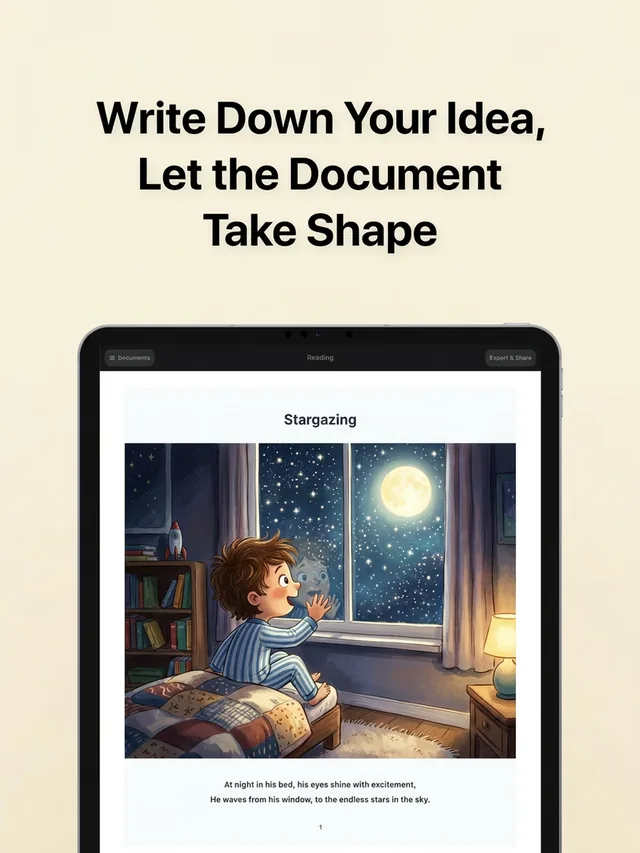
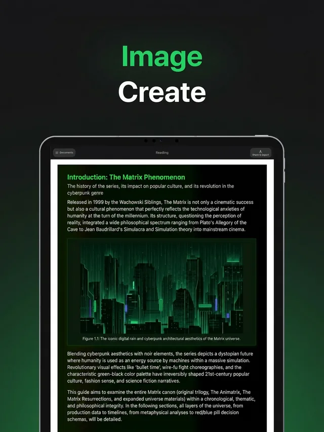
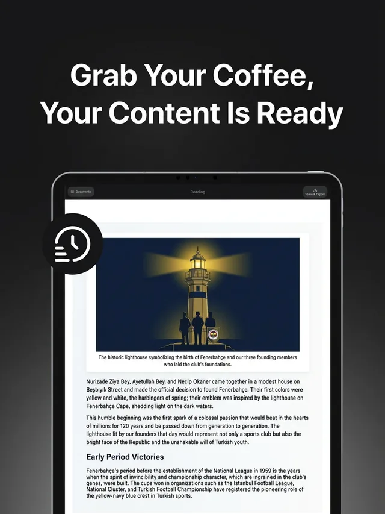

# Tasvir

### Yapay zekâ ile çalışma notu, kitap ve doküman üretici — bir PDF'i ya da tek bir konu cümlesini 200 sayfaya kadar görselli, yazdırılabilir bir dokümana çevirir.

Ders notunu yükle ya da neye çalıştığını yaz; Tasvir uzun soluklu, görselli bir doküman yazsın — çalışma rehberi, ders kitabı, akademik rapor, dergi, çocuk kitabı. Planlayıcı ajan tek kelime yazılmadan *önce* hedef kitleyi, sayfa akışını, temayı ve görselleri belirler; sohbet ekranındaki metin yığını yerine görsel, tablo, grafik ve diyagram içeren, 200 sayfaya kadar sayfalanmış bir doküman alırsın. Kayıt olan her hesaba bir kez 300 kredi (yaklaşık beş sayfa) tanımlanıyor ve istemini hangi dilde yazarsan doküman o dilde geliyor.

 

*▲ 90 saniyelik demoyu izlemek için tıkla*

## Canlı örnekler

> Bunlar Tasvir'de duran gerçek dokümanları açar — kayıt gerekmiyor. Hepsinin altında onu üreten **istemin tamamı** duruyor: kopyalarsın, kendine göre değiştirirsin, kendi versiyonunu üretirsin.

> YKS'ye çalışıyorsan ayrı bir katalog var: 83 TYT/AYT konu anlatımı ve 44 test — **[Tasvir-YKS-Hazirlik](https://github.com/Tasvir-app/Tasvir-YKS-Hazirlik)**, web hâli **[tasvir.ai/tr/yks](https://tasvir.ai/tr/yks/)**.

<table>
  <tr>
    <td align="center" width="33%">
      
       <strong>Matrix Evreni</strong> 🎬 Film &amp; Oyun
    </td>
    <td align="center" width="33%">
      
       <strong>Inception</strong> 🎬 Film &amp; Oyun
    </td>
    <td align="center" width="33%">
      
       <strong>Tarkan Diskografisi</strong> 🎵 Müzik
    </td>
  </tr>
  <tr>
    <td align="center" width="33%">
      
       <strong>Roma İmparatorluğu</strong> 📜 Tarih
    </td>
    <td align="center" width="33%">
      
       <strong>Dünya ve İklim</strong> 🌍 Coğrafya
    </td>
    <td align="center" width="33%">
      
       <strong>Galatasaray 1905-2025</strong> ⚽ Spor
    </td>
  </tr>
</table>

| Doküman | Ne gösteriyor | Kategori |
|---|---|---|
| [Matrix Evreni Rehberi](https://app.tasvir.ai/c/c2e7f526d16f9d0ecc0cddd66367466c92a91530407281d2223e34f5e60eddc2/1) | Film zaman çizelgesi, karakter kartları, kırmızı hap / mavi hap karar diyagramı | 🎬 Film &amp; Oyun |
| [Inception: Zihnin Mimarisi](https://app.tasvir.ai/c/56eb70636ffbe34864ee3c0d48d5a1416ffbadc66e79bf1188f28ad5189ff1df/1) | Rüya katmanları, karakter ilişki haritası, zaman dilatasyonu grafiği | 🎬 Film &amp; Oyun |
| [Tarkan Diskografisi](https://app.tasvir.ai/c/f51b68568ea57d6ebacc2e5562e441904ec9b77af7d7988ce19ef0f61670a464/1) | Albüm kartları, hit satış grafiği, konser haritası, dönemlerin görsel kimliği | 🎵 Müzik |
| [Roma İmparatorluğu](https://app.tasvir.ai/c/bc2e862449bacbeefdc250f590d9bc6c0d612b68bf33e8e78bac5c9044ac73ce/1) | Dönem dönem yükseliş ve çöküş, haritalar, zaman çizelgeleri | 📜 Tarih |
| [Dünya'nın Hareketleri ve İklim](https://app.tasvir.ai/c/e7f177988dab2ae1910835bbaed030f91b6cc287b7629a58412e65c402017e52/1) | Astronot gözünden Dünya, iklim ve hareket diyagramları | 🌍 Coğrafya |
| [Galatasaray 1905-2025](https://app.tasvir.ai/c/177ad48bd607ca212214bbc00b9fee659d117c3ae7f0e89e47994bc1ea9a39f4/1) | Şampiyonluk zaman çizelgesi, efsane futbolcular, UEFA 2000 finali | ⚽ Spor |

Altı kategori, altı doküman, tek motor. Aşağıdaki katalogda 🗺️ gezi, 🔬 bilim, 🧒 çocuk kitabı, 🏃 fitness, 🎓 akademik tez ve 🌐 arayüz tasarımı da var — çünkü sadece ders notu üreten bir araca doküman üretici denmez.

<b>📚 Örneklerin tamamı (kategoriye göre)</b>

 

**🎬 Film & Oyun**
- [Matrix Evreni Rehberi](https://app.tasvir.ai/c/c2e7f526d16f9d0ecc0cddd66367466c92a91530407281d2223e34f5e60eddc2/1)
- [Inception: Zihnin Mimarisi](https://app.tasvir.ai/c/56eb70636ffbe34864ee3c0d48d5a1416ffbadc66e79bf1188f28ad5189ff1df/1)
- [Half-Life: Evren ve Hikâye](https://app.tasvir.ai/c/20b80d4849f42fd45c29e21428f94080b5682585f0eb7bd17ecfadb1b370dabb/1)

**📜 Tarih**
- [Roma İmparatorluğu](https://app.tasvir.ai/c/bc2e862449bacbeefdc250f590d9bc6c0d612b68bf33e8e78bac5c9044ac73ce/1)
- [Türkiye Cumhuriyeti'nin 100. Yılı](https://app.tasvir.ai/c/8a1058a7d5a872da0d1fd281ebdebbeb7ef52f06c717de37510ddae58515c4cd/1)

**🗺️ Gezi**
- [7 Günde İstanbul Keşif Rehberi](https://app.tasvir.ai/c/3a676c1e7b96ba81b9e9d483c2249870c583a6322c4b72a5b46fac1a7c563eb5/1)

**🔬 Bilim & Teknik**
- [Kara Delikler ve Hawking Işıması](https://app.tasvir.ai/c/89a3e3aed9ac06da6acb5359251a30831e720f8ec636148f9a164c3fb0fbad7a/1)
- [Makine Öğrenmesi ve Gradyan İnişi](https://app.tasvir.ai/c/98d7a0bb1e485e88429c979ccd375a11e4cdf78ed7975694dc3f2bc91e198a47/1)

**📐 Matematik**
- [Parabol — İleri Matematik](https://app.tasvir.ai/c/80e8a3a815053662f0ecd37fb88af64a043f6d00360be4b11f7da3e39b650b03/1)
- [Analitik Geometri: Doğrular ve Çemberler](https://app.tasvir.ai/c/8ad2afeb54293022f2aad161e4c16257a853ad2d0acc598f990fea3957ed8f4e/1)

**🧒 Çocuk & Aile**
- [İnsan Vücudu Atlası](https://app.tasvir.ai/c/926ca252fb1d704ebced55dd96cf64e3c86db5e6b967fef4930f3d6931daae50/1)
- [Dinozorlar Dünyasında Bir Gün](https://app.tasvir.ai/c/751c87bc165d544786e5c7145c27c395f4064a1a6bbfc7a9791c78946cfdeea6/1)
- [Alfabe Öğrenme Kitabı](https://app.tasvir.ai/c/ee763b495a5646b323e5663aa6049e5ede20ec85cf9238a581c0ee434c6fdfd8/1)
- [Uzayda Bir Gün](https://app.tasvir.ai/c/cf963268f50ea352e5c975a5d4e8c3f99bc3e00f251a811a8c09f77d35c73063/1)

**🏃 Sağlık & Fitness**
- [14 Günlük Evde Antrenman Planı](https://app.tasvir.ai/c/c08afee45d6e075289664bfca30bac7a176e13a3517883f4e4d9c008b56a3bca/1)

**⚽ Spor & Müzik**
- [Galatasaray 1905-2025](https://app.tasvir.ai/c/177ad48bd607ca212214bbc00b9fee659d117c3ae7f0e89e47994bc1ea9a39f4/1)
- [Tarkan Diskografisi](https://app.tasvir.ai/c/f51b68568ea57d6ebacc2e5562e441904ec9b77af7d7988ce19ef0f61670a464/1)

**🎓 Akademik**
- [Türkiye'nin Yenilenebilir Enerji Politikaları (tez taslağı)](https://app.tasvir.ai/c/52331f0b92d37cfad712ed70fa8da8c4056af417127161daa22fbbba25f6e2a7/1)

**🌐 Web / Uygulama Tasarımı**
- [Online Kurs Platformu (10 ekran)](https://app.tasvir.ai/c/85c38000d0162f60352df723e91271ae4d5bab60e2c1c996a5c2def1c29e0940/1)
- [Instagram Sayfa Tasarımı (6 ekran)](https://app.tasvir.ai/c/86e896cea7d5182da26f504b1a2fd60a4f35cc6f357676ef669a4f832d49c9e0/1)

---

## Bir doküman gerçekte nasıl kuruluyor

Senin yazdığın tek şey birinci adımdaki cümle.

**1. Ne istediğini söylüyorsun.** Tek bir cümle — ya da bir PDF, Word dosyası veya not defterinin fotoğrafı.

**2. Tasvir sana sorular soruyor.** Kaç sayfa, kim okuyacak, hangi örnekler, hangi ton — cevapları hazır seçeneklere dokunarak veriyorsun. Bölüm bölüm bir plan çıkıyor ve **sen onaylamadan tek satır yazılmıyor.** Uzunluğu da sen seçiyorsun: tek dokunuşla 1, 5, 10, 15, 25 ya da 50 sayfa; istersen kendi sayını yazıyorsun, 200 sayfaya kadar.

**3. Sayfalar yazılıp çiziliyor.** Her sayfa iki geçişte üretiliyor: önce metin ve yerleşim, sonra o sayfanın görseli — geometrik çizim, grafik, tablo, LaTeX formülü, zaman çizelgesi ya da yapay zekâ görseli. Birbirine bağlı sayfalar sırayla, bağımsız olanlar aynı anda üretiliyor ve her sayfa ayrı kaydediliyor; böylece 40 sayfalık bir dokümanın 12. sayfasındaki bir aksaklık ilk 11 sayfaya mal olmuyor.

**4. Okuyorsun, beğenmediğin sayfayı değiştiriyorsun, yazdırıyorsun.** Tek bir sayfayı yeniden üretmek diğerlerine dokunmuyor. Sonra PDF/PPTX/PNG/SVG olarak dışa aktarıyor, A4/A3 yazdırıyor ya da kayıt istemeyen bir link paylaşıyorsun.

<table>
  <tr>
    <td align="center" width="33%">
      
       Tek bir cümleyle başla
    </td>
    <td align="center" width="33%">
      
       Ya da istediğin dokümanı tarif et
    </td>
    <td align="center" width="33%">
      
       Her sayfanın kendi görseli olur
    </td>
  </tr>
  <tr>
    <td align="center" width="33%">
      
       Kitap gibi oku
    </td>
    <td align="center" width="33%">
      
       Tek bir sayfayı yeniden üret
    </td>
    <td align="center" width="33%">
      
       Dışa aktar, yazdır, paylaş
    </td>
  </tr>
</table>

> Metni yazan ve görselleri tasarlayan taraf yapay zekâ, ama hiçbir zaman SVG üretmiyor. Bildirimsel bir yerleşim ağacı çıkarıyor; metni ölçen, geometriyi gerçek koordinatlara çeviren ve sayfalara bölen taraf ise senin tarayıcın. Sayfaların baskıda dağılmamasının sebebi bu.

---

## 60 saniyede dene

Kurulum yok, API anahtarı yok, kredi kartı yok.

1. **[app.tasvir.ai](https://app.tasvir.ai?src=github&utm_source=github&utm_medium=readme&utm_content=quickstart&lang=tr)** adresini aç ve kayıt ol.
2. Bir PDF, Word dosyası ya da görsel bırak — veya sadece bir konu yaz: `Türev — üniversite seviyesi, 20 sayfa`.
3. Dokümanı oku, beğenmediğin sayfayı yeniden üret, sonra A4/A3 dışa aktar ya da linkini paylaş.

Kayıt olmadan önce bakmak istersen: [Canlı örnekler](#canlı-örnekler) bölümündeki her link bitmiş bir dokümanı hesapsız açıyor.

---

## Tasvir nedir?

Tasvir sadece cevap vermez — **doküman kurar**.

Tek bir istem yaz, kendi dokümanını ekle ya da bir görsel bırak; **planlayıcı ajan** fikri yapılandırsın: konuyu, hedef kitleyi, sayfa akışını, amacı, temayı ve renk paletini anlar, sonra okuyabileceğin, paylaşabileceğin ve yazdırabileceğin uzun soluklu, görselli, sayfalanmış bir doküman üretir.

> **İstem (ya da dokümanın) → Planlayıcı → Taslak → Üretim → Oku → Paylaş → Yazdır**

## ChatGPT'den farkı ne?

ChatGPT soru cevaplar. Tasvir doküman kurar.

| | ChatGPT | Tasvir |
|---|---|---|
| Çıktı | Sohbet içinde tek bir cevap | 200 sayfaya kadar sayfalanmış doküman |
| Yapı | Sen istemle kurarsın | Planlayıcı ajan önce tasarlar |
| Görseller | Ara sıra | Varsayılan olarak görsel, tablo, grafik, zaman çizelgesi, diyagram |
| Yazdırma | Kopyala-yapıştır ve yeniden biçimlendir | A4 ya da A3 sayfa; PDF / PPTX / PNG / SVG |
| Hatayı düzeltme | Yeniden sor, her şeyi baştan oku | Tek bir sayfayı yeniden üret |

## Her şeyden başla

Sana uyan yoldan bir doküman oluştur:

- **Sadece istem** — bir fikir yaz, Tasvir dokümanın tamamını kursun.
- **Sadece doküman** — bir PDF, Word dosyası ya da görsel ekle, Tasvir onu daha zengin bir sürüme dönüştürsün.
- **Doküman + istem** — dosyanı ekle ve ne istediğini söyle: *"bu görselsiz kitabı resimli yap"*, *"bu notları görsel bir rehbere çevir"*, *"bu raporu dergi gibi yeniden tasarla"*.
- **Görsel + istem** — bir görseli açıklaması, iyileştirmesi ya da referans alması için ekle, sonra istediğin dokümanı iste.

İlk ekranda tek bir **PDF, Word dosyası ya da görsel** ekleyebilirsin. Tasvir içeriğini anlamak için onu **bir kez** okur, sonra çok daha zengin bir sürümü planlayıp üretir. Dosya yalnızca o üretimde kullanılır ve **saklanmaz**.

## Tasvir'i farklı kılan ne?

- **Sohbet değil doküman odaklı** — tek bir cevap değil, 200 sayfaya kadar sayfalanmış bir doküman.
- **Her şeyden başla** — bir istem, bir doküman, bir görsel ya da doküman artı istem.
- **Önce plan** — yapay zekâ yazmadan *önce* hedef kitleyi ve sayfa akışını planlar.
- **Varsayılan olarak görsel** — görseller, tablolar, grafikler, zaman çizelgeleri, diyagramlar.
- **Sayfa bazlı düzenleme** — bir sayfayı diğerlerine dokunmadan yeniden üret.
- **Yazdırılabilir çıktı** — A4 ya da A3 sayfa; PDF, PPTX, PNG ya da SVG.
- **Çok alanlı** — eğitim, bilim, tarih, sağlık, spor, iş dünyası, çocuk.
- **Her dilde** — istemini hangi dilde yazarsan doküman o dilde gelir.

## Kimin için?

| | |
|---|---|
| **Öğrenciler** | Görsel, yazdırılabilir çalışma notları ve sınav hazırlık rehberleri |
| **Öğretmenler** | Ders paketleri, çalışma kâğıtları, konu anlatımları, etkinlikler |
| **Üreticiler** | Rehberler, oyun kitapları, raporlar, paylaşılabilir kaynaklar |
| **Ebeveynler** | Çocuğa uygun kitaplar, atlaslar, öğrenme paketleri |
| **Girişimciler & ekipler** | Raporlar, lansman planları, şirket içi dokümanlar, panolar |
| **Herkes** | Herhangi bir konuyu yapılandırılmış bir dokümana çevir — tasarım bilgisi gerekmez |

---

## YKS'ye çalışıyorsan

TYT ve AYT için ayrı bir katalog var: 11 dersten **83 konu anlatımı ve 44 test**, hepsi kayıtsız açılıyor. Aynı konu on farklı öğrencinin dünyasından anlatıldı — üslü sayılar Minecraft oynayan Emre'ye bit ve bellek üzerinden, hareket ve kuvvet Formula 1 izleyen Kaan'a pist üzerinden.

- Katalog: **[tasvir.ai/tr/yks](https://tasvir.ai/tr/yks/)**
- İstemlerin tamamı: **[Tasvir-YKS-Hazirlik](https://github.com/Tasvir-app/Tasvir-YKS-Hazirlik)**

---

### Aklındaki dokümanı bir cümleyle anlat, gerisini Tasvir yapsın.

**Üret. Oku. Öğren. Paylaş. Yazdır.**

Tasvir işine yaradıysa bu repoya vereceğin bir ⭐ başkalarının da bulmasına yardım eder.

Soru ve görüşlerin için: [support@tasvir.ai](mailto:support@tasvir.ai)

*This README in English: **[Tasvir-app/Tasvir](https://github.com/Tasvir-app/Tasvir)***

